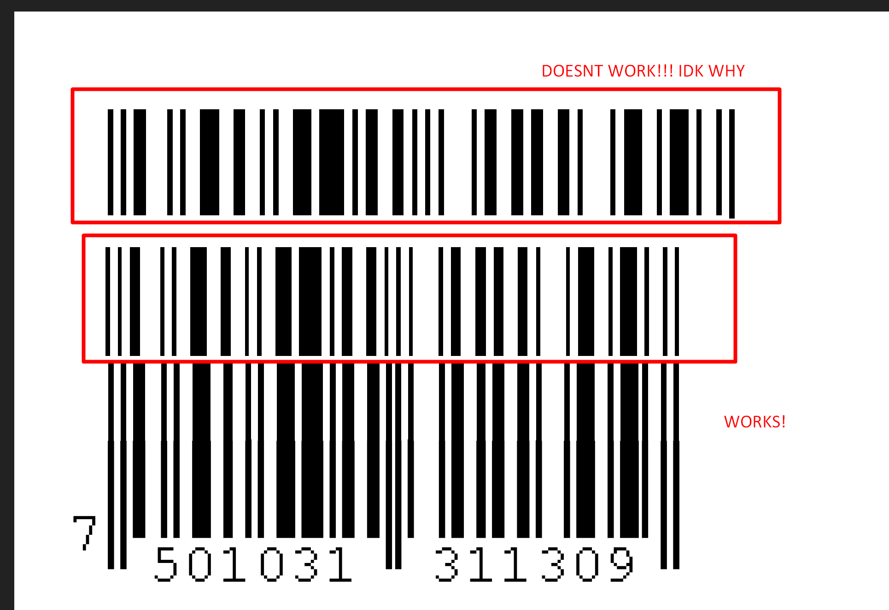

# barcode-generator
 p5.js app to generate barcodes given some data
[](https://shields.io/)[](https://opensource.org/licenses/MIT)
```
by oran collins
github.com/wisehackermonkey
oranbusiness@gmail.com
20200625
```

# Live Demo
# [click here](#)


# Dev Log


- [EAN-13](https://en.wikipedia.org/wiki/International_Article_Number)
- [UPC-A](https://en.wikipedia.org/wiki/Universal_Product_Code)

# semi-working barcode untested


# try 2


#### great example 
- [EAN-13 BACKGROUND INFORMATION](http://www.barcodeisland.com/ean13.phtml)

# Try v3 still not working for some reason!

#### what its supposed to look like


# update figured out why id didnt scan the aspect ration was way off!
#### i overlayed the refrence with mine and it showed the issue


# funny mistake
#### [P5.js web editor link](https://editor.p5js.org/wisemonkey/present/3BL7cmc4a)


# brain storming
- map array of bits to pixels
- map array to lines 
- test barcode with scanner
    - to test array to pixel use example data
- helper function that turns numbers into [l,g,r]-digits (encoded) bit pattern
- combine multiple digits into one array
- way to indicate start, center and end markers

### example of a barcode v1
```
start    data        center                 end
101  | <42 digits> | 01010 |  <42 digits> | 101
```

```
open questions what are arias?
how does parity work for this thing?
is it actaull 13 digit max
```

pattern mapping
```
first digit = 13
mapping is LLGLGG

L for digit 5
is 0110001


8 = LGLGGL and RRRRRR

8 711253 001202
expands to 
011101101100110011001001101101110010111101


simple case 

101 01010 101
```

# Working out a case for 111111111111 (111-111-111-111) len 12
```text
first digit is 1 so encode second group with RRRRRR
[if digit is 0 then encode with pattern      LLLLLL]
number    encoding
111-111 = 
111-111 = RRRRRR
Check digit (CRC) is = 6

Encoding of the digits
      ODD    all     even
Num L-code	G-code	R-code
0	0001101	0100111	1110010
1	0011001	0110011	1100110
2	0010011	0011011	1101100
3	0111101	0100001	1000010
4	0100011	0011101	1011100
5	0110001	0111001	1001110
6	0101111	0000101	1010000
7	0111011	0010001	1000100
8	0110111	0001001	1001000
9	0001011	0010111	1110100

 
DIGIT
         LEFT        RIGHT
     ODD      EVEN |  ALL
0	0001101	0100111	1110010
1	0011001	0110011	1100110
2	0010011	0011011	1101100
3	0111101	0100001	1000010
4	0100011	0011101	1011100
5	0110001	0111001	1001110
6	0101111	0000101	1010000
7	0111011	0010001	1000100
8	0110111	0001001	1001000
9	0001011	0010111	1110100

number breakdown
11 country code
11111 manaugature code 
11111 right hand side 
6 check digit

More detail

EAN PARITY ENCODING TABLE
Encoding of the digits
                      1   2   3    4    5   6
0: 1 is the pattern Odd|Odd|Even|Odd|Even|Even (is implied and not actually rendered weird but par for the system)

Left guard:                          101
LEFT hand encoded
1: 1 (odd): odd code for number 1 is 0011001
2: 1 (odd): odd code for number 1 is 0011001
3: 1(Even):even code for number 1 is 0110011
4: 1 (Odd): odd code for number 1 is 0011001
5: 1(Even):even code for number 1 is 0110011
6: 1(Even):even code for number 1 is 0110011

CENTER Guard:                        01010

LEFT hand encoded
7: 1(ALL):even code for number 1 is 1100110
8: 1(ALL):even code for number 1 is 1100110
9: 1(ALL):even code for number 1 is 1100110
10:1(ALL):even code for number 1 is 1100110
11:1(ALL):even code for number 1 is 1100110

Check digit
12:6(ALL):even code for number 6 is 1010000

Right Guards:                       101


Full Encoding 
101      left guard
0011001 0011001 0110011 0011001 0110011 0110011 
01010    center
1100110 1100110 1100110 1100110 1100110 
1010000  check 
101      right guard

GOAL 
write code that converts the whole train for 1 digit

```
# Update got it working! (20201001)
.png)
### note
#### still issue with scanning from phone. weird but works with www.onlinebarcodereader.com

#also added node tests!
# testing 
```bash
npm install --save-dev tape faucet
npx tape test/**/*.js

nodemon --exec npx tape test/**/*.js
```

# TODO
- ~~render a actual example barcode and have it read correctly~~
    - ~~issue with example check if each bit is correct~~
- ~~debug improvements: for start middle and end sentinals render them longer than the other bars like shown in example~~
 

- ~~debug using photoshop overly exapcted with actual~~
- ~~arbitray number enter to render barcode~~
    - ~~implement crc calculation~~
    - ~~map first number string[0] to LGGLLG thing~~
- add input box for new barcode numbers
- fix phone not reading issue
- publish to ghpages