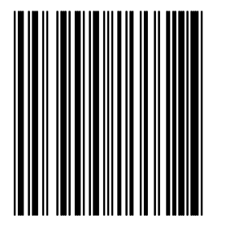

# barcode-generator
 p5.js app to generate barcodes given some data
[](https://shields.io/)[](https://opensource.org/licenses/MIT)
```
by oran collins
github.com/wisehackermonkey
oranbusiness@gmail.com
20200625
```

# Live Demo
# [click here](#)


# Dev Log


- [EAN-13](https://en.wikipedia.org/wiki/International_Article_Number)
- [UPC-A](https://en.wikipedia.org/wiki/Universal_Product_Code)

# semi-working barcode untested


# try 2


#### great example 
- [EAN-13 BACKGROUND INFORMATION](http://www.barcodeisland.com/ean13.phtml)

# Try v3 still not working for some reason!

#### what its supposed to look like

# funny mistake
#### [P5.js web editor link](https://editor.p5js.org/wisemonkey/present/3BL7cmc4a)

# TODO list

# brain storming
- map array of bits to pixels
- map array to lines 
- test barcode with scanner
    - to test array to pixel use example data
- helper function that turns numbers into [l,g,r]-digits (encoded) bit pattern
- combine multiple digits into one array
- way to indicate start, center and end markers

### example of a barcode v1
```
start    data        center                 end
101  | <42 digits> | 01010 |  <42 digits> | 101
```

```
open questions what are arias?
how does parity work for this thing?
is it actaull 13 digit max
```

pattern mapping
```
first digit = 13
mapping is LLGLGG

L for digit 5
is 0110001


8 = LGLGGL and RRRRRR

8 711253 001202
expands to 
011101101100110011001001101101110010111101


simple case 

101 01010 101
```


# TODO
- ~~render a actual example barcode and have it read correctly
    - issue with example check if each bit is correct
- debug improvements: for start middle and end sentinals render them longer than the other bars like shown in example 

